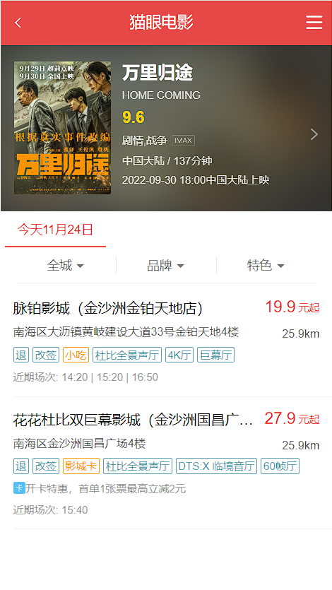
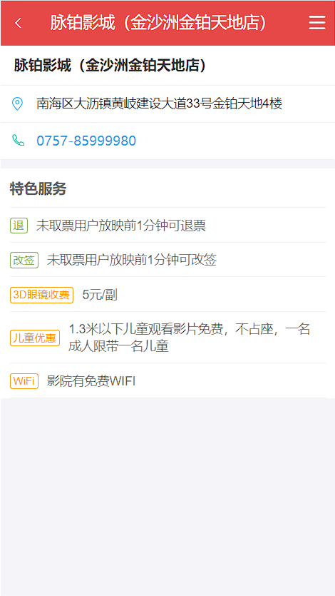
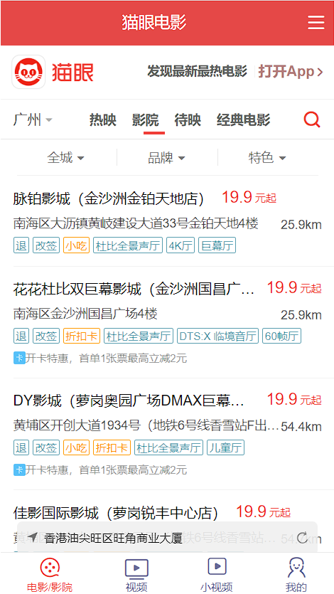
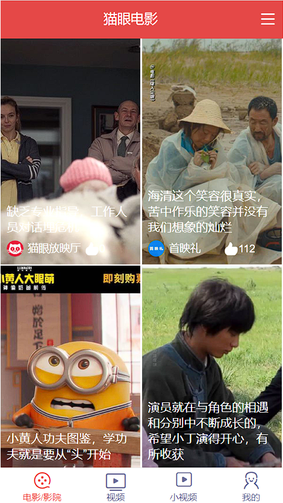
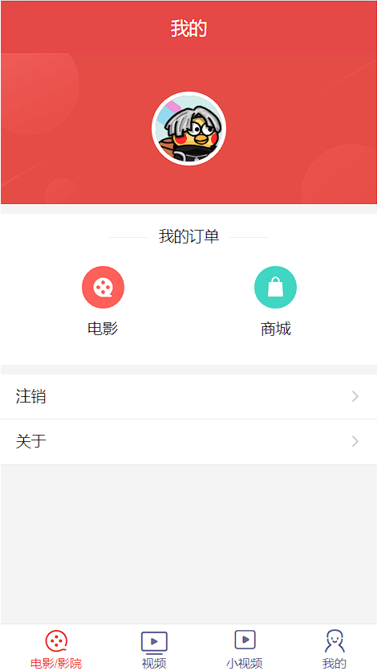

# 仿猫眼网页App

📽使用 Vue.js 开发的简单仿猫眼电影App端。仅作学习用途。

## 开发环境

  
  
  
  

## 如何使用

    git clone https://github.com/Discover999/maoyan-vue.git
    npm install
    npm run serve
打开首页 [localhost:8080](http://localhost:8080/) 预览效果

## 技术栈

Vue2.6 + Vuex + Vue Router + axios + less + vant

## 项目演示

## 说明

目前项目仍然可能存在一些bug和小问题，如有更多修改建议欢迎提交pr  
如果可以请帮忙点个Star✨,感谢支持💖

> 因目前接口访问缓慢、超时报错等，若加载数据时间长或无法加载，请等待接口恢复即可。
